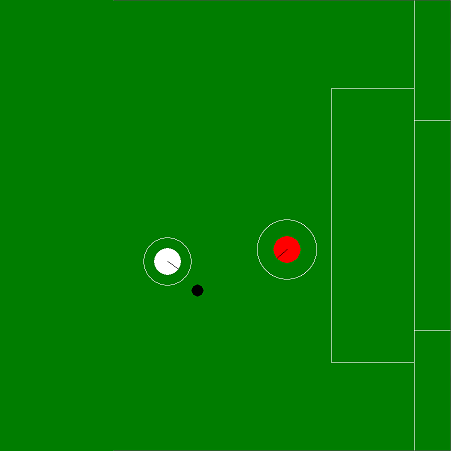

# Robot Soccer Goal



The Robot Soccer Goal environment [[Masson et al. 2016]](https://arxiv.org/abs/1509.01644) uses a parameterised action space and continuous state space. The task involves an agent learning to kick a ball past a keeper. Three actions are available to the agent:

- kick-to(x,y)
- shoot-goal-left(y)
- shoot-goal-right(y)

A reward of 50 is given for a successful goal, and `-distance(ball, goal)` otherwise. An episode terminate if the ball enters the goals, is captured by the keeper, or leaves the play area.

This code is a port of https://github.com/WarwickMasson/aaai-goal to use the OpenAI Gym framework.

## Dependencies

- Python 3.5+ (tested with 3.5 and 3.6)
- gym 0.10.5
- pygame 1.9.4
- numpy

## Installation

Install this as any other OpenAI gym environment:

    git clone https://github.com/cycraig/gym-goal
    cd gym-goal
    pip install -e '.[gym-goal]'
    
or 

    pip install -e git+https://github.com/cycraig/gym-goal#egg=gym_goal
    
    
## Example Usage

```python
import gym
import gym_goal
env = gym.make('Goal-v0')
```

See https://github.com/cycraig/MP-DQN for an example on how to make an agent for this environment.
    
## Citing

If you use this domain in your research, please cite the original author:

    @inproceedings{Masson2016ParamActions,
        author = {Masson, Warwick and Ranchod, Pravesh and Konidaris, George},
        title = {Reinforcement Learning with Parameterized Actions},
        booktitle = {Proceedings of the Thirtieth AAAI Conference on Artificial Intelligence},
        year = {2016},
        location = {Phoenix, Arizona},
        pages = {1934--1940},
        numpages = {7},
        publisher = {AAAI Press},
    }
    
You may also consider citing the following paper:

    Coming soon...